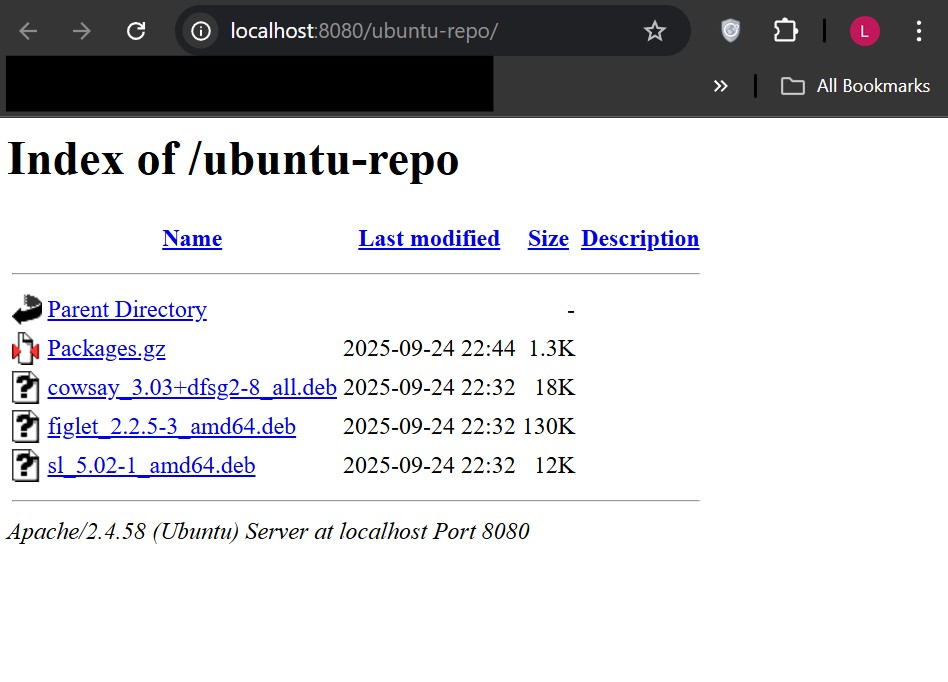

# Local Apt Repository Server Setup on Ubuntu/WSL2
## Objective

Create a local APT repository to serve .deb packages via Apache2, enabling offline or controlled package installations.

### 1. Prerequisites

-Ubuntu installed (WSL2 or native).
-Apache2 installed and running.
-dpkg-dev installed to create the repository index.

```
sudo apt update
sudo apt install -y apache2 dpkg-dev
```

- apache2: Web server to serve the repo.

- dpkg-dev: Provides dpkg-scanpackages to create repository metadata.

### 2. Create Repository Directory

Create a directory under the Apache web root to store your .deb packages:

```
sudo mkdir -p /var/www/html/ubuntu-repo
cd /var/www/html/ubuntu-repo
```

- This will host .deb files and metadata (Packages.gz).

### 3. Add .deb Packages

Copy your packages into the repository directory:

```
cp ~/Downloads/cowsay_3.03_all.deb .
cp ~/Downloads/figlet_2.2.5_all.deb .
cp ~/Downloads/sl_5.02_all.deb .
```

- Any .deb can be added here.

### 4. Generate Package Metadata

```
sudo dpkg-scanpackages . /dev/null | gzip -9c | sudo tee Packages.gz > /dev/null
```

- Creates Packages.gz containing package information for APT.

- If you see warnings like:

```
Packages in archive but missing from override file: cowsay figlet sl
```

- It’s normal; override file is optional.

### 5. Set Permissions

```
sudo chown -R www-data:www-data /var/www/html/ubuntu-repo
sudo chmod -R 755 /var/www/html/ubuntu-repo
```

- Ensures Apache can read the repo files.

### 6. Configure Apache

Restart Apache to serve the repository:

```
sudo systemctl restart apache2
sudo systemctl status apache2
```

- Apache will serve the repo on http://localhost:8080/ubuntu-repo/.

### 7. Configure APT Client

Create a source list for your local repo:

```
echo "deb [trusted=yes] http://localhost:8080/ubuntu-repo ./" | sudo tee /etc/apt/sources.list.d/local-repo.list
```

- trusted=yes avoids GPG key warnings for local packages.

Disable language translation warnings:

```
echo 'Acquire::Languages "none";' | sudo tee /etc/apt/apt.conf.d/99disable-translations
```

### 8. Update APT and Test

```
sudo apt update
```

- You may see 404 for /InRelease or /Release; this is normal for a minimal repo.

- The important part is that Packages.gz is fetched.

Test installing a package from your local repo:

```
sudo apt install --reinstall cowsay
```

Check which source APT will use:

```
apt-cache policy cowsay
```

Expected output:

```
Installed: 3.03+dfsg2-8
Candidate: 3.03+dfsg2-8
Version table:
  1001 http://localhost:8080/ubuntu-repo ./ Packages
  500 https://archive.ubuntu.com/ubuntu noble/universe amd64 Packages
```

- This confirms that your local repo is recognized and prioritized.

### 9. Optional: Verify Repo Contents

```
curl http://localhost:8080/ubuntu-repo/Packages.gz | gunzip | grep Package
```

Expected output:

```
Package: cowsay
Package: figlet
Package: sl
```

### 10. Notes / Troubleshooting

- Permission Denied Errors: Always use sudo or sudo tee when generating Packages.gz in /var/www/html.

- Warnings about missing override file: Safe to ignore for small, personal repos.

- 404 Errors for Release/InRelease: Normal for a local repo; APT only requires Packages.gz.

- If APT doesn’t pick up the repo: Ensure Apache is running and Packages.gz exists.

#### Result

- Local APT repository is functional.

- Packages can be installed via:

```
sudo apt update
sudo apt install cowsay figlet sl
```


### Summary

- Apache serves .deb packages under /var/www/html/ubuntu-repo.

- dpkg-scanpackages creates Packages.gz.

- APT is configured to use the local repository.

- Packages can now be installed locally without downloading from the internet.

